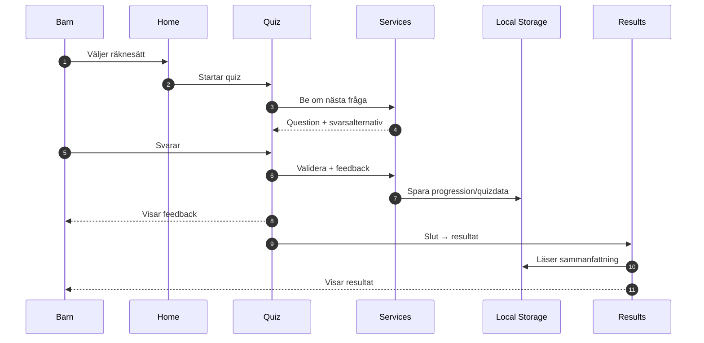

# Projektdokumentation

## Arkitekturöversikt (hela appen)

**Regel (enkel och praktisk):**
- `domain/` ska vara Flutter-fritt (pedagogik, modeller, regler).
- `core/` är tekniskt/Flutter-nära (DI, audio, UI-nära helpers).
- Konstanter för lär-algoritmer ligger i `domain/constants/`.

Det här är en “helikoptervy” som visar hur appen hänger ihop från bootstrap till UI/state/services och persistens.

```mermaid
flowchart TB
  %% End-to-end: bootstrap -> presentation -> state -> services -> data -> storage

  subgraph Bootstrap[Bootstrap / Startup]
    MAIN[main()] --> HIVEINIT[Hive.initFlutter()]
    MAIN --> DI[initializeDependencies()]
    MAIN --> PS[ProviderScope]
    PS --> APP[MathGameApp (MaterialApp)]
    DI --> GETIT[GetIt container]
  end

  subgraph Presentation[Presentation / Screens]
    ENTRY[AppEntryScreen]
    PICKER[ProfilePickerScreen]
    HOME[HomeScreen]
    QUIZ[QuizScreen]
    RESULTS[ResultsScreen]
    SETTINGS[SettingsScreen]
    PIN[ParentPinScreen]
    PARENT[ParentDashboardScreen]

    APP --> ENTRY
    ENTRY --> HOME
    ENTRY --> PICKER
    PICKER --> HOME
    HOME --> QUIZ
    QUIZ --> RESULTS
    HOME --> SETTINGS
    HOME --> PIN
    PIN --> PARENT
    PARENT --> SETTINGS
  end

  subgraph State[State (Riverpod providers)]
    QP[quizProvider (QuizNotifier)]
    UP[userProvider (UserNotifier)]
    PP[parentSettingsProvider]
    DP[ageGroup/operation/difficulty providers]
  end

  subgraph Core[Core (Services + DI)]
    QGS[QuestionGeneratorService]
    AS[AudioService]
    ACS[AchievementService]
    QPS[QuestProgressionService]
  end

  subgraph Data[Data (Repositories)]
    LSR[LocalStorageRepository]
  end

  subgraph Storage[Storage]
    HIVE[(Hive boxes)]
  end

  subgraph Domain[Domain]
    MODELS[Entities + Enums\n(t.ex. Question, QuizSession, UserProgress)]
    ADS[AdaptiveDifficultyService]
    SRS[SpacedRepetitionService]
    FS[FeedbackService]
    PPS[ParentPinService]
  end

  %% UI reads/writes state via providers
  HOME --> DP
  QUIZ --> QP
  RESULTS --> UP
  SETTINGS --> UP
  PIN --> PPS
  PARENT --> PP

  %% Providers resolve dependencies through GetIt
  QP --> GETIT
  UP --> GETIT
  PP --> GETIT

  %% Domain services are also resolved through GetIt
  PPS --> GETIT

  %% GetIt provides services and repositories
  GETIT --> QGS
  GETIT --> AS
  GETIT --> ACS
  GETIT --> QPS
  GETIT --> LSR

  %% Domain services are also resolved through GetIt
  GETIT --> ADS
  GETIT --> SRS
  GETIT --> FS

  %% Services/repo persist to Hive
  LSR --> HIVE
  ACS --> LSR
  QPS --> LSR

  %% Domain models are used across layers
  QGS -.-> MODELS
  ADS -.-> MODELS
  FS -.-> MODELS
  LSR -.-> MODELS
  QP -.-> MODELS
  UP -.-> MODELS
  PPS -.-> MODELS

  %% PIN service persists via LocalStorageRepository
  PPS --> LSR
```

## Mermaid-diagram (arkitektur + flöden)

Mermaid-diagram i Markdown ger versionshanterad, “levande” dokumentation.

### Lager (Clean-ish Architecture)

```mermaid
flowchart TB
  subgraph Presentation[Presentation]
    Home[Home / Screens]
    Quiz[Quiz Screen]
    Entry[AppEntry Screen]
    ProfilePicker[Profile Picker]
    Parent[Parent Dashboard]
    ParentPin[Parent PIN]
    Widgets[Widgets]
  end

  subgraph Domain[Domain]
    Entities[Entities]
    Enums[Enums]
    DomainServices[Services\n(t.ex. ParentPinService)]
  end

  subgraph Core[Core]
    Services[Services]
    DI[DI / GetIt]
    Config[Config / Constants]
  end

  subgraph Data[Data]
    Repos[Repositories]
    Hive[(Hive Local Storage)]
  end

  Presentation --> Core
  Presentation --> Domain
  Core --> Data
  Data --> Hive

  Entry --> Widgets
  ProfilePicker --> Widgets
  Home --> Widgets
  Quiz --> Widgets
  Parent --> Widgets
  ParentPin --> Widgets
  Services --> Repos
  DI --> Services
  DI --> Repos
```

### Quiz-flöde (happy path)



## Översikt

Detta är ett pedagogiskt mattespel för barn (6-13+ år) som bygger på vetenskaplig forskning om effektiv inlärning av matematik.

## Projektstruktur

```
lib/
├── core/                       # Kärnfunktionalitet
│   ├── config/                # Konfigurationsfiler
│   │   └── difficulty_config.dart
│   ├── constants/             # Konstanter
│   │   └── app_constants.dart
│   ├── di/                    # Dependency Injection
│   │   └── injection.dart
│   ├── utils/                 # Små utilities
│   │   └── page_transitions.dart
│   └── services/              # Tekniska/apputrymmen (Flutter-nära)
│       ├── question_generator_service.dart
│       ├── achievement_service.dart
│       ├── quest_progression_service.dart
│       └── audio_service.dart
│
├── data/                      # Dataskikt
│   └── repositories/          # Repositories
│       └── local_storage_repository.dart
│
├── domain/                    # Ren affärslogik (Flutter-fritt)
│   ├── constants/
│   │   └── learning_constants.dart
│   └── services/
│       ├── adaptive_difficulty_service.dart
│       ├── spaced_repetition_service.dart
│       ├── feedback_service.dart
│       └── parent_pin_service.dart
│
├── domain/                    # Domänlogik
│   ├── entities/             # Entiteter
│   │   ├── question.dart
│   │   ├── user_progress.dart
│   │   └── quiz_session.dart
│   └── enums/                # Enums
│       ├── age_group.dart
│       ├── operation_type.dart
│       ├── difficulty_level.dart
│       ├── app_theme.dart
│       └── mastery_level.dart
│   └── services/              # Domain services
│       └── parent_pin_service.dart
│
└── presentation/              # Presentation/UI
  ├── screens/              # Skärmar
  │   ├── app_entry_screen.dart
  │   ├── home_screen.dart
  │   ├── profile_picker_screen.dart
  │   ├── quiz_screen.dart
  │   ├── results_screen.dart
  │   ├── settings_screen.dart
  │   ├── onboarding_screen.dart
  │   ├── parent_pin_screen.dart
  │   └── parent_dashboard_screen.dart
  ├── dialogs/
  │   └── create_user_dialog.dart
  └── widgets/              # Återanvändbara widgets
    └── (flera, se lib/presentation/widgets/)
```

## Nästa Steg

### Fas 2: Kärn-Lärsystem (Vecka 3-4)

#### 1. Adaptivt Svårighetssystem
- **Fil:** `lib/core/services/adaptive_difficulty_service.dart`
- **Funktionalitet:**
  - Spåra användarens prestanda över senaste 5-10 frågorna
  - Justera svårighetsgrad baserat på framgångsfrekvens
  - Målet: 70-80% framgångsfrekvens
  - Om >85% korrekt → öka svårighetsgrad
  - Om <60% korrekt → minska svårighetsgrad

#### 2. Spaced Repetition System
- **Fil:** `lib/core/services/spaced_repetition_service.dart`
- **Funktionalitet:**
  - Algoritm för att schemalägga repetition av tidigare frågor
  - Intervaller: 2-3 dagar → 1 vecka → 2 veckor
  - Prioritera frågor med tidigare felaktiga svar
  - Balansera nya koncept (70%) med repetition (30%)

#### 3. Feedback-system
- **Fil:** `lib/core/services/feedback_service.dart`
- **Funktionalitet:**
  - Generera specifik, konstruktiv feedback för varje fråga
  - Förklara konceptet bakom rätt/fel svar
  - Olika feedback-nivåer baserat på åldersgrupp

#### 4. Quiz-skärm
- **Fil:** `lib/presentation/screens/quiz_screen.dart`
- **Funktionalitet:**
  - Visa fråga med tydlig formatering
  - Inmatningsalternativ (multiple choice eller numerisk)
  - Timer (valfri)
  - Framstegsindikator
  - Omedelbar feedback-modal

#### 5. Resultatskärm
- **Fil:** `lib/presentation/screens/results_screen.dart`
- **Funktionalitet:**
  - Visa sammanfattning (korrekta svar, tid, poäng)
  - Visuell representation (stjärnor, medaljer)
  - Upplåsningar och achievements

## Kod-generering

Efter att ha implementerat Hive-adapters, kör:

```bash
flutter pub run build_runner build --delete-conflicting-outputs
```

Detta kommer att generera:
- `user_progress.g.dart` - Hive TypeAdapter för UserProgress

## Testning

För att köra tester:

```bash
# Alla tester
flutter test

# Med coverage
flutter test --coverage

# Specifikt test
flutter test test/question_generator_test.dart
```

### Test-typer i projektet

- `test/` innehåller unit- och widget-tester (körs med `flutter test`).
- `integration_test/` innehåller integrationstester (körs också med `flutter test`, men driver hela appflöden).

Exempel:

```bash
# Integration smoke
flutter test integration_test/app_smoke_test.dart

# Integration screenshots
flutter test integration_test/screenshots_test.dart
```

Not: `integration_test/tap_count_test.dart` är opt-in och körs bara om `RUN_TAP_COUNT=1` är satt i environment.

## Dependencies

Viktiga dependencies och deras syfte:

- **flutter_riverpod** - State management
- **hive** - Lokal databas (NoSQL)
- **audioplayers** - Ljud och musik
- **flutter_animate** - Animationer
- **lottie** - Vektorbaserade animationer
- **google_fonts** - Typografi
- **get_it** - Dependency injection
- **equatable** - Enkel jämförelse av objekt
- **uuid** - Generera unika ID:n

## Konventioner

### Kodstil
- Använd `const` konstruktorer där möjligt
- Trailing commas för multiline arguments
- Single quotes för strings
- Uttryckliga return types

### Filnamning
- Snake case: `my_file.dart`
- Screens: `*_screen.dart`
- Widgets: `*_widget.dart`
- Services: `*_service.dart`

### Git Commits (Rekommendation)
- `feat:` - Ny funktionalitet
- `fix:` - Buggfix
- `refactor:` - Kod-refaktorering
- `test:` - Testning
- `docs:` - Dokumentation
- `style:` - Formatering

## Pedagogisk Grund

Detta projekt baseras på vetenskaplig forskning:

1. **Spaced Repetition** - Beprövad metod för långtidsminne
2. **Retrieval Practice** - Testning förstärker inlärning
3. **Interleaving** - Blanda olika problemtyper
4. **Immediate Feedback** - Omedelbar, specifik återkoppling
5. **Growth Mindset** - Betona ansträngning över resultat
6. **Adaptive Learning** - Anpassa svårighetsgrad till individen

Se även README för en kort översikt av mål och scope.
