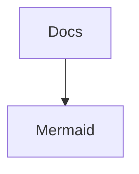
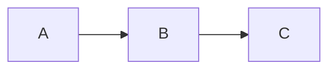
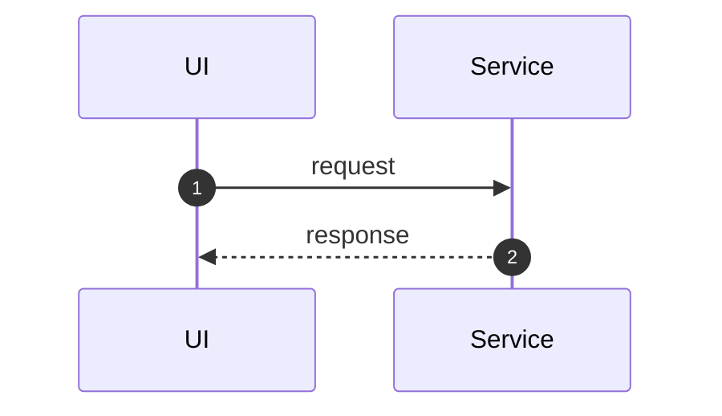

# Mermaid i repo:t

Målet: diagram ska vara **lätta att uppdatera**, **rendera i VS Code** och **rendera på GitHub**.

## VS Code-workflow

- Öppna valfri `.md` med Mermaid.
- Öppna preview: `Ctrl+Shift+V` (Preview) eller `Ctrl+K V` (Preview to the Side).
- Skriv/ändra diagram direkt i filen – preview uppdateras.

> Tips: Om preview inte renderar Mermaid, kontrollera att extension `bierner.markdown-mermaid` är installerad.

## GitHub-workflow

GitHub renderar Mermaid i Markdown när du använder:

## Konventioner (rekommenderat)

- Lägg arkitekturdiagram i [docs/ARCHITECTURE.md](ARCHITECTURE.md).
- Lägg flödesdiagram nära respektive funktionsdokument (t.ex. `docs/SERVICES_API.md`).
- Namnge diagram på ett sätt som matchar screenshots/test-namn (t.ex. `quiz_flow`, `user_profile_setup`).

## Snabbmallar

### Flowchart

### Sequence

