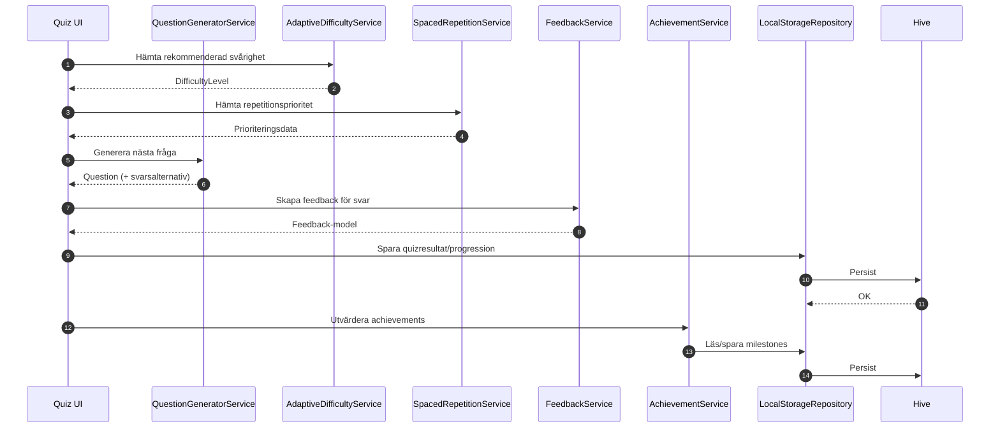

# Services – API (MVP)

Det här dokumentet beskriver appens centrala “services” på en nivå som är praktiskt användbar för utveckling/test.

## Mermaid – service-karta

```mermaid
flowchart TB
	UI[Presentation / UI]

	subgraph Domain[Domain (Flutter-fritt)]
		ADS[AdaptiveDifficultyService]
		SRS[SpacedRepetitionService]
		FS[FeedbackService]
	end

	subgraph Core[Core (tekniskt)]
		QS[QuestionGeneratorService]
		AS[AchievementService]
		AU[AudioService]
	end

	UI --> QS
	UI --> ADS
	UI --> SRS
	UI --> FS
	UI --> AS
	UI --> AU

	QS --> LSR[LocalStorageRepository]
	ADS --> LSR
	SRS --> LSR
	AS --> LSR
	AU --> LSR

	LSR --> H[(Hive)]
```

## Mermaid – typiskt quiz-flöde (översikt)



> Not: Namn och exakta signaturer kan ändras; se källkod för detaljer.

## QuestionGeneratorService
**Syfte:** Skapa matematikfrågor anpassade till ålder/årskurs, räknesätt och svårighet.

**Beteende (översikt):**
- Genererar `Question` med operand(er) inom intervall från `DifficultyConfig.getNumberRange(...)`.
- Ska producera svarsalternativ (inkl rätt svar) för UI.

## AdaptiveDifficultyService
**Syfte:** Justera svårighetsnivå baserat på användarens prestation.

**Beteende (översikt):**
- Tar hänsyn till success rate och ev. response times.
- Returnerar rekommenderad `DifficultyLevel` för framtida frågor/sessioner.

## SpacedRepetitionService
**Syfte:** Prioritera repetition av sådant användaren nyligen haft svårt för.

**Beteende (översikt):**
- Lagrar och uppdaterar “styrkor/svagheter” per fråga/område.
- Väljer uppgifter för repetition med jämna mellanrum.

## FeedbackService
**Syfte:** Ge åldersanpassad feedback efter varje svar.

**Beteende (översikt):**
- Skapar en feedbackmodell som UI visar i `FeedbackDialog`.
- Kan variera språk/ton baserat på `AgeGroup`.

## AchievementService
**Syfte:** Hantera achievements (låsa upp, namnge, presentera).

**Beteende (översikt):**
- Utvärderar “milestones” baserat på quizresultat och användarprogress.
- Levererar display-namn för achievements.

## AudioService
**Syfte:** Spela ljudeffekter/musik (och respektera inställningar per användare).

**Beteende (översikt):**
- Spelar “correct”, “wrong”, “celebration”.
- Läser inställningar (ljud/musik on/off) och ska inte spela om avstängt.

## LocalStorageRepository
**Syfte:** Lokal persistens (Hive) för users, quizhistorik och settings.

**Beteende (översikt):**
- Spara/ladda användarprofiler, aktiv användare, quizhistorik.
- Spara/ladda settings (t.ex. onboarding flag, audio settings, parent PIN).
