# Services – API (MVP)

Det här dokumentet beskriver appens centrala “services” på en nivå som är praktiskt användbar för utveckling/test.

## Mermaid – service-karta

```mermaid
flowchart TB
	UI[Presentation / UI]

	subgraph Domain[Domain (Flutter-fritt)]
		ADS[AdaptiveDifficultyService]
		SRS[SpacedRepetitionService]
		FS[FeedbackService]
	end

	subgraph Core[Core (tekniskt)]
		QS[QuestionGeneratorService]
		AS[AchievementService]
		AU[AudioService]
	end

	UI --> QS
	UI --> ADS
	UI --> SRS
	UI --> FS
	UI --> AS
	UI --> AU

	QS --> LSR[LocalStorageRepository]
	ADS --> LSR
	SRS --> LSR
	AS --> LSR
	AU --> LSR

	LSR --> H[(Hive)]
```

## Mermaid – typiskt quiz-flöde (översikt)

```mermaid
sequenceDiagram
	autonumber
	participant UI as Quiz UI
	participant QS as QuestionGeneratorService
	participant ADS as AdaptiveDifficultyService
	participant SRS as SpacedRepetitionService
	participant FS as FeedbackService
	participant AS as AchievementService
	participant LSR as LocalStorageRepository
	participant H as Hive

	UI->>ADS: Hämta rekommenderad svårighet
	ADS-->>UI: DifficultyLevel

	UI->>SRS: Hämta repetitionsprioritet
	SRS-->>UI: Prioriteringsdata

	UI->>QS: Generera nästa fråga
	QS-->>UI: Question (+ svarsalternativ)

	UI->>FS: Skapa feedback för svar
	FS-->>UI: Feedback-model

	UI->>LSR: Spara quizresultat/progression
	LSR->>H: Persist
	H-->>LSR: OK

	UI->>AS: Utvärdera achievements
	AS->>LSR: Läs/spara milestones
	LSR->>H: Persist
```



> Not: Namn och exakta signaturer kan ändras; se källkod för detaljer.

## QuestionGeneratorService
**Syfte:** Skapa matematikfrågor anpassade till ålder/årskurs, räknesätt och svårighet.

**Beteende (översikt):**
- Genererar `Question` med operand(er) inom intervall från `DifficultyConfig.getNumberRange(...)`.
- Ska producera svarsalternativ (inkl rätt svar) för UI.

## AdaptiveDifficultyService
**Syfte:** Justera svårighetsnivå baserat på användarens prestation.

**Beteende (översikt):**
- Tar hänsyn till success rate och ev. response times.
- Returnerar rekommenderad `DifficultyLevel` för framtida frågor/sessioner.

## SpacedRepetitionService
**Syfte:** Prioritera repetition av sådant användaren nyligen haft svårt för.

**Beteende (översikt):**
- Lagrar och uppdaterar “styrkor/svagheter” per fråga/område.
- Väljer uppgifter för repetition med jämna mellanrum.

## FeedbackService
**Syfte:** Ge åldersanpassad feedback efter varje svar.

**Fil:** `lib/domain/services/feedback_service.dart`

**Beteende (översikt):**
- Skapar en feedbackmodell som UI visar i `FeedbackDialog`.
- Kan variera språk/ton baserat på `AgeGroup`.
- Kan inkludera “spel-metadata” som UI visar (t.ex. 🪙 poäng, ⚡ snabbbonus, 🔥 svit).

## AchievementService
**Syfte:** Hantera achievements (låsa upp, namnge, presentera).

**Beteende (översikt):**
- Utvärderar “milestones” baserat på quizresultat och användarprogress.
- Levererar display-namn för achievements.

## AudioService
**Syfte:** Spela ljudeffekter/musik (och respektera inställningar per användare).

**Beteende (översikt):**
- Spelar “correct”, “wrong”, “celebration”.
- Läser inställningar (ljud/musik on/off) och ska inte spela om avstängt.

## LocalStorageRepository
**Syfte:** Lokal persistens (Hive) för users, quizhistorik och settings.

**Beteende (översikt):**
- Spara/ladda användarprofiler, aktiv användare, quizhistorik.
- Spara/ladda settings (t.ex. onboarding flag, audio settings, parent PIN).
